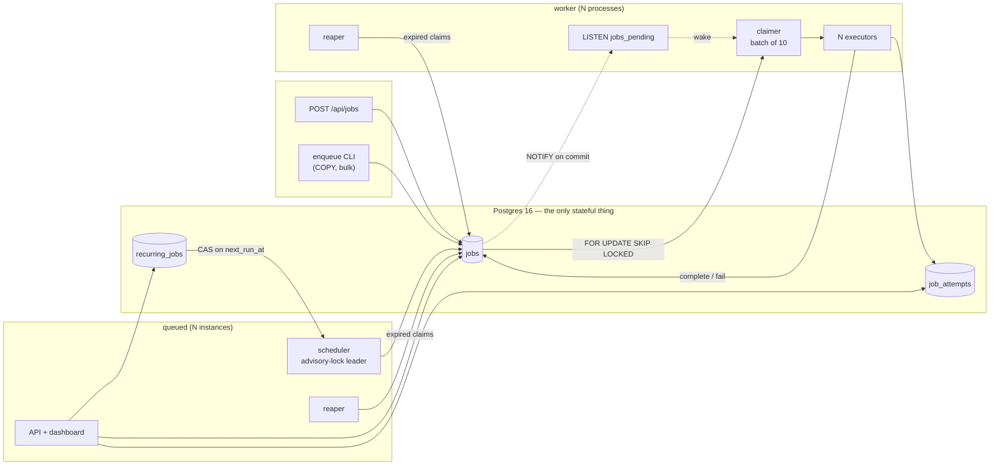
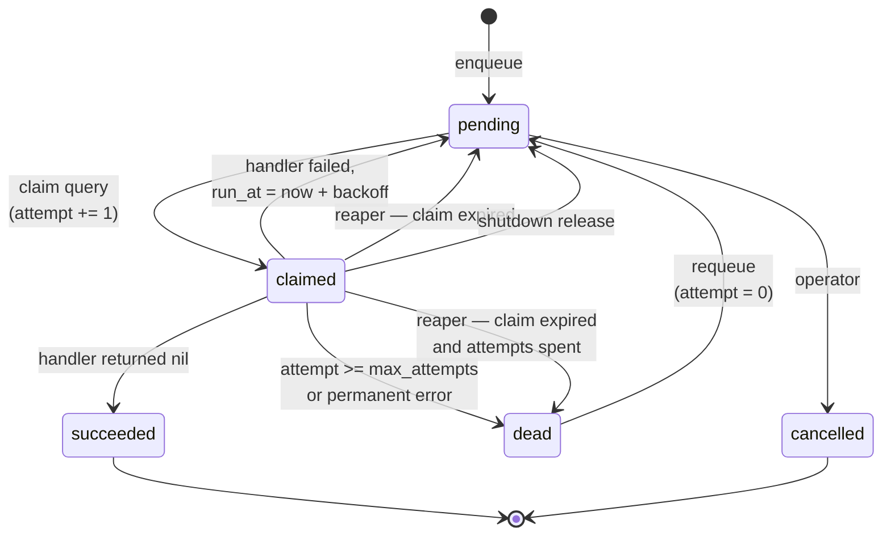

# queued

A durable background job queue backed by Postgres alone. No Redis, no broker.
Jobs are enqueued into a table, claimed by a pool of workers with
`SELECT ... FOR UPDATE SKIP LOCKED`, retried with exponential backoff, and
parked in a dead-letter queue when they will never succeed.

## Correctness properties

These are the reasons the project exists, and each one is proven by a test in
`internal/worker/properties_test.go` that runs against a real Postgres. Nothing
is mocked: the guarantees are properties of Postgres row locking, and a fake
would only prove that the fake agrees with itself.

| # | property | proven by | how |
| --- | --- | --- | --- |
| 1 | **No double execution under concurrency** | `TestProperty1_NoDoubleExecutionUnderConcurrency` | 1000 jobs, 20 independent pools with their own worker IDs and claimers. Asserts every job ran, the handler was entered exactly 1000 times (counted in Go, independent of the database), `job_attempts` holds no duplicate `(job_id, attempt)` pair, and there are exactly 1000 attempt rows. Also passes under `-race -count=10`. |
| 2 | **No lost jobs on worker death** | `TestProperty2_NoLostJobsOnWorkerDeath` | Claims a job and never reports — indistinguishable from SIGKILL as far as the database is concerned. Checks nobody else can touch it before the timeout, then that the reaper returns it, another worker runs it, and *both* attempts survive in the history. |
| 3 | **No lost jobs on graceful shutdown** | `TestProperty3_RealSIGTERMDrainsInFlightJobs` | Builds `cmd/worker`, runs it as a real process, and sends it a real `SIGTERM` one second into four 5-second jobs. Asserts it exits 0, all four succeeded, none stranded in `claimed`, and the drain took about as long as the work — not the 30s deadline. |
| 4 | **Bounded retries** | `TestProperty4_BoundedRetries` | A job that can never succeed runs exactly `max_attempts` times and no more, then sits in `dead` with its reason recorded. |
| 5 | **At-least-once, not exactly-once** | `TestProperty5_AtLeastOnceIsObservable` | Proves the *negative*: a handler that ignores its context is caught running twice concurrently on the same job. This is the contract, not a bug. |
| — | **Idempotency key dedupes** | `TestPropertyIdempotencyKeyCreatesOneJob` | Five enqueues with one key produce one row and one execution. |

Property 3 is tested against the real binary rather than a cancelled context on
purpose. Between "the pool drains when its context is cancelled" and "sending
SIGTERM to a worker is safe" sit `signal.NotifyContext`, the process exit path,
and whether the binary is wired up the way the pool expects — none of which a
cancelled context exercises.

### Why exactly-once is not on offer

A handler runs, and then its result is written to Postgres. Those are two
separate steps, and the worker can die in between: the work is done and nothing
records it, so the job is retried and the work happens twice. Closing that gap
would mean the handler's side effect and the queue's bookkeeping committing
together in one transaction — possible only if the side effect *is* a write to
the same database, which rules out sending an email, charging a card, or calling
anyone else's API. For everything else the choice is at-least-once or
at-most-once, and at-most-once means silently dropping work.

So: **handlers must be idempotent.** Give the work a natural key and make the
second execution a no-op — `INSERT ... ON CONFLICT DO NOTHING` on a
`(job_id, side_effect)` row, or an idempotency key on the upstream API. The
queue helps by making retries visible and bounded, not by pretending they cannot
happen.

## Status

All nine phases are done, benchmarks included.
**~10,000 jobs/sec**, and the claim query costs 4% more at a million rows than
at a thousand — see [Benchmarks](#benchmarks).

```
make up       # postgres + queued + 3 workers
make seed     # a mixed backlog to look at
make race     # go test -race ./...  — the gate on every phase
```

58 tests, all against a real Postgres started by testcontainers. Green under
`-race` at `-count=3`; property 1 also at `-count=10`.

## Architecture



Nothing talks to anything but Postgres. There is no worker registry, no
heartbeat, no coordination protocol, and no service discovery: workers find work
by running a query, and the only thing they share is a table.

## Job state machine



Two things worth reading off that diagram:

- **`attempt` increments on the `pending → claimed` edge**, not on failure. That
  is why a worker that dies silently still burns an attempt, and why the reaper
  has a `claimed → dead` edge at all.
- **There is no `failed` state**, though the enum has the value. A failed attempt
  with retries left goes back to `pending`; one without goes to `dead`. There is
  no moment in between for a job to occupy.

## The scheduler

`internal/scheduler/cron.go`. Every `queued` instance runs one; a Postgres
advisory lock decides which one acts.

Expressions are parsed with `robfig/cron`, accepting standard five-field cron,
an optional leading seconds field, and `@`-descriptors. Seconds exist mostly so
the tests observe ten ticks in ten seconds rather than one in sixty, but they
cost nothing and the rest of the system never sees the difference.

### Why an advisory lock is enough

- **The database is already a hard dependency.** Adding etcd or Consul to elect
  a leader for work that only matters when Postgres is up means adding a second
  thing that can fail in order to guard against the first one failing.
- **Session-scoped locks are released automatically when the connection ends** —
  clean exit, crash, `kill -9`, network partition, server restart. No lease to
  expire, no TTL to tune, no way to leave a lock held by a process that no
  longer exists.
- It is one function call on a connection we already have.

### Its failure mode, stated plainly

**The lock is released on connection loss, and that release is not coordinated
with the leader noticing.** If the network drops, Postgres tears the session
down and frees the lock immediately, while the leader may not find out until its
next query. In that window a second instance can acquire the lock and start
scheduling while the first still believes it leads. The same happens if the
leader is paused long enough for TCP to give up — a stop-the-world GC pause, a
hypervisor freeze, a suspended laptop.

That is not a defect in advisory locks. It is the standard result that a
distributed lock without fencing gives mutual exclusion of *lock ownership*, not
of *work*. Anything needing the stronger guarantee must not rely on leadership.

### So leadership is an optimisation, not the guarantee

Correctness lives in the data, in three layers, and would hold with the election
deleted entirely:

1. **Compare-and-swap.** Advancing an entry only matches if `next_run_at` is
   still the value the scheduler read, so only one instance can move a given
   tick forward.
2. **One statement.** The `INSERT` selects from that `UPDATE`'s output, so a
   scheduler that lost the swap inserts nothing — not because it checked, but
   because there is nothing to select from. There is also no window where a
   scheduler advanced the tick and then died before enqueueing.
3. **Idempotency key.** `cron:<name>:<scheduled unix>` — derived from the entry
   and the instant, not the process, so two schedulers that somehow both won
   would be writing the same key and the unique index collapses them.

```sql
WITH advanced AS (
    UPDATE recurring_jobs SET last_run_at = now(), next_run_at = $3
    WHERE id = $1 AND next_run_at = $2 AND enabled
    RETURNING queue, kind, payload
)
INSERT INTO jobs (queue, kind, payload, idempotency_key)
SELECT queue, kind, payload, $4 FROM advanced
ON CONFLICT (idempotency_key) DO NOTHING
RETURNING id
```

`TestNoDuplicatesWithoutLeadership` bypasses the election completely — 24
goroutines all convinced the same tick is theirs — and exactly one wins.

### Missed ticks are dropped, not replayed

A scheduler that was down for an hour with a per-minute schedule does not owe
sixty runs. The next run is computed from *now*, not from the missed instant:
the point of "every minute" is freshness, and sixty stale runs are worse than
one fresh one. `TestMissedTicksAreDroppedNotReplayed` fakes an hour of downtime
on a per-second schedule and gets 3 jobs, not 3600.

### Demonstrated

Three `queued` instances against one database, `*/5 * * * * *`:

```
$ go run ./cmd/enqueue -kind succeed -cron '*/5 * * * * *' -name heartbeat
scheduled "heartbeat": succeed runs */5 * * * * *, next at 2026-09-08T20:40:40+05:30

=== who led? ===
instance 1: 1
instance 2: 0
instance 3: 0

{"msg":"recurring job enqueued","recurring_job":"heartbeat","job_id":1,"scheduled_for":"2026-09-08T15:10:40Z","next_run_at":"2026-09-08T15:10:45Z"}
{"msg":"recurring job enqueued","recurring_job":"heartbeat","job_id":2,"scheduled_for":"2026-09-08T15:10:45Z","next_run_at":"2026-09-08T15:10:50Z"}
{"msg":"recurring job enqueued","recurring_job":"heartbeat","job_id":3,"scheduled_for":"2026-09-08T15:10:50Z","next_run_at":"2026-09-08T15:10:55Z"}

 total | distinct_ticks
-------+----------------
     5 |              5
```

One leader of three, ticks landing on the exact five-second boundaries, and
every job a distinct instant.

## The reaper

`internal/worker/reaper.go`. A loop that returns jobs whose claim outlived its
visibility timeout.

This is the whole of the worker-death machinery, and it is deliberately almost
nothing: **there is no heartbeat, no worker registry, no liveness protocol.** A
claim carries an expiry, and if nobody reports a result before it passes, the
job goes back. Nothing in the system ever needs to decide whether a worker is
alive — a question that is genuinely hard to answer and easy to answer wrongly.

Every instance runs its own reaper, including the API server. There is no
election and none is wanted: the sweep uses `FOR UPDATE SKIP LOCKED`, so
concurrent reapers divide the expired rows rather than fight over them. A reaper
is a janitor, not a singleton service, and several are strictly safer than one
that might be on the instance that just died. The server runs one too, because
otherwise the failure that most needs recovering from — every worker dying at
once — is the one case with nobody left to fix it.

**Every reclaim is logged individually, at warn.** A reclaim is never normal: it
means a worker died holding that job, or a handler ran past its timeout. A
counter alone does not tell you which job and which worker at 3am.

```json
{"level":"WARN","msg":"job reclaimed from an expired claim","job_id":41,"attempt":2,"lost_worker_id":"worker-7","returned_to":"pending"}
```

A sweep keeps going while batches come back full, so a fleet-wide restart is
cleared in a few queries rather than one batch per tick.

Demonstrated on the compose stack — 30 jobs of 8s work each with a 20s
visibility timeout, spread over three workers, then `docker kill -s KILL` on one
of them so it has no chance to clean up after itself:

```
victim = 6ed93279e6fe-1, holding: 10 jobs
$ docker kill -s KILL goproject-worker-1

=== reclaims by lost worker ===
  10 "lost_worker_id":"6ed93279e6fe-1"

=== final ===
   state   | count
-----------+-------
 succeeded |    30
```

Exactly the ten jobs the killed worker was holding came back, nobody else's
were disturbed, and all thirty finished.

### Two timeouts, and which one fires first

A handler that runs too long is caught by the **pool**, not the reaper: the
job's context carries its visibility timeout as a deadline, so the pool cancels
it, fails the job, and frees the slot. The reaper never sees it.

That ordering matters. If only the reaper enforced the timeout, a hung handler
would hold its slot indefinitely while a second worker ran the same job
alongside it. Cancelling locally means the slot comes back and there is only one
execution in flight. The reaper is the backstop for the case the pool cannot
handle — a process that is simply gone.

### Connection pool sizing, and the LISTEN connection

pgx defaults `MaxConns` to `max(4, numCPU)`. A worker needs one connection per
executor reporting a result, plus the claimer, plus the reaper. At the default
`CONCURRENCY=8` that is ten consumers sharing eight connections; on a four-core
box with `CONCURRENCY=32` it would be thirty-four sharing four. Nothing errors —
pgx just queues — so the symptom is everything getting slower under load, which
is a miserable thing to debug. The worker sizes its pool as `CONCURRENCY + 4`,
overridable with `DB_MAX_CONNS`.

The NOTIFY listener is deliberately **not** in that count: it opens its own
connection instead of borrowing one from the pool. A `LISTEN` connection is held
for the entire life of the process — it sits blocked in `WaitForNotification`
and is never given back — so taking it from the query pool permanently removes
one connection. That is survivable for a single worker and not survivable in
general: N pools sharing one pgxpool each take one and hold it, and once N
reaches `MaxConns` the pool is *entirely* consumed by listeners, no claim query
can ever acquire a connection, and everything deadlocks with no error anywhere.

That is not hypothetical. The property-1 test runs twenty pools against one
pgxpool of fourteen, and it hung until the listener got its own connection.

### Requeue resets `attempt` to 0

A requeue is an operator saying "I fixed the thing that was breaking this". The
previous failures are history, not a budget already spent — handing the job back
with a spent counter would send it straight back to the DLQ on its first
attempt, making the button useless exactly when it matters.

`job_attempts` is deliberately untouched. A job that failed five times and was
then requeued should still show all five when somebody asks why.

## The worker pool

`internal/worker/pool.go`. One claimer goroutine feeding N executors over a
buffered channel.

**One claimer, not N.** If every executor ran its own claim query, the load on
the hot path would scale with concurrency — and the claim query is the one thing
every worker in the fleet contends on. A single claimer taking ten at a time
keeps that contention flat as concurrency goes up.

**Nothing busy-loops.** An idle claimer blocks on a three-way select: a NOTIFY
wakeup, the poll timer, or shutdown.

**Every job runs under `context.WithTimeout(ctx, job.VisibilityTimeout)`.** Past
that deadline the reaper is entitled to hand the job to somebody else, so a
handler still working past it is at best wasting effort and at worst about to
become a second concurrent execution.

**Panics are recovered per job.** A panicking handler is a bug in one job's
code, not in the queue, and it must not stop the worker from running the other
thousand. The stack goes into `last_error` — a panic with no stack is nearly
useless to whoever has to fix it.

### Retryable vs permanent errors

The question is not "did it fail" but "would running it again plausibly give a
different answer".

- **Retryable** — a timeout, a 503 from an upstream, a deadlock. Nothing about
  the job is wrong; the world was temporarily unhelpful. Full retry budget.
- **Permanent** — the payload fails validation, or names a user that does not
  exist. The next four attempts fail identically, so burning the budget on them
  only delays the operator finding out. Handlers signal it with
  `worker.Permanent(err)`, and the job goes straight to `dead`.

One case that looks permanent and deliberately is not: **an unregistered kind**.
During a rolling deploy the old workers do not yet have the handler for a kind
the new code enqueues. Treating that as permanent would dead-letter every such
job in the window between the first new enqueue and the last old worker going
away. Retrying instead means the job waits and lands on a worker that knows what
to do with it. If the kind really was a typo, it reaches the DLQ a few minutes
later — a much cheaper mistake than the other direction.

### Backoff

`base * 2^attempt` capped at `max`, with **full jitter**: the exponential curve
sets the ceiling and the actual delay is drawn uniformly from zero up to it.

The jitter is not a nicety. The failure this queue is most likely to meet is a
shared dependency going down, which fails every in-flight job at nearly the same
instant. Pure exponential backoff schedules all of those retries for the same
moment, so the recovering dependency is hit by the whole fleet at once, falls
over again, and the herd re-forms — now synchronised more tightly than before.
Spreading each retry across its window turns that spike into a flat arrival
rate. Full jitter rather than the milder "half plus jitter" because nothing here
cares whether one job waits 0.2s or 1.9s, and the herd protection is strictly
better the wider the draw.

### LISTEN/NOTIFY *and* polling

Migration 0003 adds triggers that `pg_notify('jobs_pending')`. The insert
trigger is **statement-level**, not row-level, which matters because
`EnqueueMany` goes over `COPY` — a row-level trigger would emit 50,000
notifications for one 50,000-row load. Retries and reclaims put existing rows
back to `pending` without inserting, so they get a second, row-level trigger.

The two mechanisms fail in opposite directions, which is exactly why you need
both:

| | polling | NOTIFY |
| --- | --- | --- |
| reliable? | yes — no state, survives any disconnect, cannot miss work | no — fire-and-forget, notifications sent while disconnected are simply gone |
| fast? | no — latency and idle query load are one dial | yes — woken the instant the transaction commits, costs nothing idle |

So NOTIFY collapses common-case latency from one poll interval to microseconds,
and the poll timer underneath guarantees that a missed notification costs one
interval of delay rather than a job that never runs. **The queue is correct
because of the polling and fast because of the NOTIFY.**

### Graceful shutdown

`signal.NotifyContext` cancels one context; every shutdown decision hangs off
that single cancellation.

1. **The claimer stops immediately.** No new work from the moment the signal
   lands.
2. **Claimed-but-unstarted jobs are released straight back to `pending`.** They
   have not run, so there is nothing to wait for.
3. **In-flight jobs keep running** on a context that deliberately does *not*
   inherit the cancellation, and get `DrainTimeout` (default 30s) to finish.
4. **Anything still running at the deadline is cancelled and its job released
   explicitly**, rather than left for the reaper. That turns a
   visibility-timeout-long stall into an immediate handover.

One subtlety worth naming: Go's `select` chooses at random when several cases
are ready, so a plain two-case select would have let executors keep pulling
buffered jobs after the signal for as long as the buffer lasted. The executors
check cancellation in a non-blocking select first, so "stop taking new work"
means what it says.

Real output from `docker compose stop worker`, with 60 ten-second jobs in
flight:

```json
{"level":"INFO","msg":"shutdown: released jobs back to pending","worker_id":"b73fa79b9431-1","count":2,"reason":"worker shut down before dispatch"}
{"level":"INFO","msg":"shutdown: claimer stopped, draining in-flight jobs","worker_id":"b73fa79b9431-1"}
{"level":"INFO","msg":"shutdown: releasing claimed-but-unstarted jobs","worker_id":"b73fa79b9431-1","count":10}
{"level":"INFO","msg":"shutdown: released jobs back to pending","worker_id":"b73fa79b9431-1","count":10,"reason":"worker shut down before the job started"}
{"level":"INFO","msg":"shutdown: all in-flight jobs finished","worker_id":"b73fa79b9431-1"}
{"level":"INFO","msg":"shutdown complete","worker_id":"b73fa79b9431-1"}
```

Final state: 16 succeeded, 44 back in `pending`, **0 left in `claimed`**, all 60
accounted for. The whole drain took 7.8s — the length of the longest job still
running, not the 30s deadline.

### The handlers

`testdata/handlers` has six, each existing because some property needs a job
that behaves that way: one that succeeds, one that always fails, one that fails
twice then succeeds, one that runs past its visibility timeout, one that panics,
and one that rejects its payload permanently.

Note that the go tool skips `testdata/` when expanding `./...`, so that package
is not built by `go build ./...`. It is compiled by the tests that import it.

## The claim query

`internal/queue/store.go`. This is the core of the project.

```sql
WITH candidate AS (
    SELECT id FROM jobs
    WHERE state = 'pending'
      AND queue = $1
      AND run_at <= now()
    ORDER BY priority ASC, run_at ASC
    FOR UPDATE SKIP LOCKED
    LIMIT $3
), claimed AS (
    UPDATE jobs SET
        state            = 'claimed',
        claimed_at       = now(),
        claimed_by       = $2,
        claim_expires_at = now() + make_interval(secs => visibility_timeout_seconds),
        attempt          = attempt + 1
    WHERE id IN (SELECT id FROM candidate)
    RETURNING ...
), history AS (
    INSERT INTO job_attempts (job_id, attempt, worker_id, started_at)
    SELECT id, attempt, $2, now() FROM claimed
)
SELECT ... FROM claimed ORDER BY priority ASC, run_at ASC
```

**Why `SKIP LOCKED`.** Without it, a worker whose index scan reaches a row
another worker has locked *blocks* until that worker's transaction ends. Every
worker then queues up behind whichever one got to the head of the queue first,
and N workers deliver the throughput of one — worse, actually, since you now pay
for the lock waits too. With `SKIP LOCKED` a locked row is stepped over and the
scan keeps going, so each worker walks away with a disjoint set and no worker
ever waits on another. This one clause is the entire reason Postgres is a
viable queue rather than a bottleneck pretending to be one.

**Why the subquery.** `FOR UPDATE` is what makes the choice of rows exclusive,
and it can only be attached to a `SELECT`. You cannot write
`UPDATE ... ORDER BY ... LIMIT ... FOR UPDATE`. So the selection happens in a
subquery that takes the locks, and the `UPDATE` operates on the ids it returns.

**Why `attempt` increments at claim time, not at failure time.** A worker that
is SIGKILLed, loses its network, or wedges never reports anything at all. A
counter that only advanced on a *reported* failure would therefore never advance
for exactly the jobs most likely to be killing workers, and a poison job would
be reclaimed forever. Charging the attempt up front means such a job still walks
to the DLQ. The cost is real — a worker restarted mid-job makes its job pay for
the interruption — and it is the right trade: bounded retries (property 4)
matter more than squeezing a last attempt out of an unlucky job.

**Why the attempt row is written in the same statement.** If the worker inserted
into `job_attempts` after the claim returned, a worker that died in between
would leave no trace of having taken the job at all. Writing it inside the claim
means every claim is on the record before anyone can act on it.

### The reaper's index

Migration 0002 adds `claim_expires_at`. The natural way to write the reaper is

```sql
WHERE state = 'claimed'
  AND claimed_at + make_interval(secs => visibility_timeout_seconds) < now()
```

which cannot use an index: the timeout is per-row, so the comparison spans two
columns of the same row and the planner has to sequential-scan to evaluate it.
That is fine on a small table and quietly becomes the most expensive thing in
the system on a large one — and the reaper runs every few seconds, forever.
Materialising the deadline at claim time turns it into a range scan. With 20,050
claimed rows of which 55 are expired:

```
Limit (actual time=0.068..0.081 rows=55 loops=1)
  ->  LockRows
        ->  Sort
              ->  Bitmap Heap Scan on jobs
                    ->  Bitmap Index Scan on jobs_reap_idx (actual time=0.007..0.007 rows=55)
                          Index Cond: (claim_expires_at < now())
Execution Time: 0.116 ms
```

It touches the 55 expired rows, not the 20,000 live ones.

### Guarding against stale claims

`Complete`, `Fail` and `Release` all carry `AND claimed_by = $2`. This is not
decoration. If the reaper has already decided a worker is dead and handed its
job to somebody else, the slow worker coming back to report must not be allowed
to mark the job succeeded while the new owner is still running it. The update
matches nothing and the caller gets `ErrStaleClaim` instead.

### What is proven so far

`go test -race ./internal/queue` — 15 tests, all against a real Postgres started
by testcontainers (see `internal/testutil`). Nothing is mocked: SKIP LOCKED
handing disjoint sets to concurrent transactions *is* the mechanism, and a fake
would only prove that the fake agrees with itself.

| test | what it pins down |
| --- | --- |
| `ClaimHandsOutDisjointSets` | 1000 jobs, 20 concurrent claimers, no id returned twice, all 1000 accounted for (property 1) |
| `ClaimSkipsAlreadyClaimed` | a claimed job is invisible to the next claimer |
| `ClaimIncrementsAttemptAndRecordsHistory` | attempt moves at claim, expiry is set, the attempt row exists immediately |
| `ClaimRespectsPriorityThenRunAt` | ordering is honoured |
| `ClaimIgnoresFutureAndOtherQueues` | delayed jobs and other queues stay invisible |
| `CompleteClosesTheAttempt` | success closes the history row |
| `CompleteAndFailRejectStaleClaims` | a worker cannot report on a job it no longer holds |
| `FailSchedulesRetryThenGivesUp` | retries, then `dead` after exactly `max_attempts`, and no more (property 4) |
| `FailPermanentSkipsTheRetryBudget` | a permanent error goes straight to `dead` |
| `ReapReturnsExpiredClaims` | an unreported claim comes back and another worker runs it (property 2) |
| `ReapSendsExhaustedJobsToTheDLQ` | a job that keeps killing workers still stops |
| `ReleaseReturnsJobsImmediately` | explicit handback, no visibility-timeout wait (backs property 3) |
| `EnqueueIdempotencyKeyDedupes` | two enqueues, one row |
| `EnqueueIdempotencyKeyUnderRace` | 16 concurrent enqueues with one key: one row, one reported insert |
| `EnqueueRejectsBadInput` | missing kind, bad JSON, empty key, zero max_attempts |

`ClaimHandsOutDisjointSets` also passes under `-race -count=10`.

## Schema

Three tables in `migrations/0001_init.sql`:

| table | what it is |
| --- | --- |
| `jobs` | the queue itself, one row per job |
| `job_attempts` | append-only history, one row per try |
| `recurring_jobs` | cron definitions |

`state` is a real Postgres enum (`pending`, `claimed`, `succeeded`, `failed`,
`dead`) rather than a text column, so a typo in a query is an error instead of a
job that quietly never runs again.

Two check constraints are worth calling out. `jobs_claim_fields` says a job in
`claimed` must have both `claimed_at` and `claimed_by` set — without that, the
reaper has no way to decide whether a claim has expired, and a job could be lost
exactly the way property 2 forbids. `jobs_max_attempts_positive` keeps
`max_attempts >= 1`, since zero would mean a job that goes straight to the DLQ
without ever running.

`job_attempts` is deliberately **not** unique on `(job_id, attempt)`. That
constraint looks like it would enforce property 1, but it would not: if two
workers really did claim the same row they would each get a *different* attempt
number (attempt increments at claim time), so the insert would succeed and the
bug would be invisible. Worse, the constraint would make the double-execution
test pass by construction instead of by observation. The test counts executions
instead.

### Migrations

Forward-only, applied by a ~200 line runner in `internal/migrate`. It takes a
`pg_advisory_lock` first, so `docker compose up` starting the API and three
workers simultaneously does not have four processes racing to create the same
table — the first one migrates, the rest block and then find nothing to do. Each
migration runs in its own transaction (Postgres has transactional DDL, so a
failure halfway leaves nothing behind), and the file's SHA-256 is recorded so
editing a migration that has already been applied is a hard error rather than a
silent schema drift.

```
make migrate        # or: go run ./cmd/queued -migrate
```

There are no down migrations. Rolling a migration back in production is mostly a
lie — you cannot un-drop a column's data — and locally `make down` throws the
volume away, which is faster and more honest than a rollback path nobody tests.

### Why the claim index is partial

```sql
CREATE INDEX jobs_claim_idx ON jobs (queue, priority, run_at)
    WHERE state = 'pending';
```

Only `pending` rows can ever be claimed, and a healthy queue is mostly history —
the backlog is small, the pile of finished jobs is not. Measured on a table
seeded with 500k `succeeded` and 100k `pending` rows:

| index | size |
| --- | --- |
| partial, `WHERE state = 'pending'` | **912 kB** |
| same columns, no `WHERE` | 20 MB |

The whole table is 124 MB. The partial index tracks the size of the *backlog*
rather than the size of the *table*, which is what keeps it in `shared_buffers`
when the table is tens of gigabytes.

The write side matters just as much. A job's life is
`pending -> claimed -> succeeded`. With a full index every one of those
transitions rewrites an index entry. With the partial index, leaving `pending`
deletes the entry and it never comes back — finished jobs stop costing anything
on write, forever.

Column order follows the query: equality on `queue` first, then the two
`ORDER BY` columns in order, so the planner walks the index in order and stops
at `LIMIT` instead of sorting.

### EXPLAIN ANALYZE on the claim query

600k rows, 100k of them pending, `LIMIT 10`, run inside a transaction that is
rolled back:

```
 Update on jobs (actual time=3.380..3.906 rows=10 loops=1)
   Buffers: shared hit=264 read=3 dirtied=2 written=1
   ->  Nested Loop (actual time=0.300..0.673 rows=10 loops=1)
         ->  HashAggregate (actual time=0.241..0.244 rows=10 loops=1)
               Group Key: "ANY_subquery".id
               ->  Subquery Scan on "ANY_subquery" (actual time=0.083..0.236 rows=10 loops=1)
                     ->  Limit (actual time=0.078..0.227 rows=10 loops=1)
                           ->  LockRows (actual time=0.077..0.225 rows=10 loops=1)
                                 ->  Index Scan using jobs_claim_idx on jobs jobs_1 (actual time=0.042..0.148 rows=10 loops=1)
                                       Index Cond: ((queue = 'default'::text) AND (run_at <= now()))
                                       Filter: (state = 'pending'::job_state)
                                       Buffers: shared hit=12
         ->  Index Scan using jobs_pkey on jobs (actual time=0.042..0.042 rows=1 loops=10)
 Planning Time: 2.547 ms
 Trigger jobs_touch_updated_at: time=0.503 calls=10
 Execution Time: 4.047 ms
```

The two things to look for:

- **`Index Scan using jobs_claim_idx`, and no `Sort` node.** The index supplies
  the `ORDER BY priority, run_at` ordering directly, so `LIMIT 10` reads twelve
  buffers and stops. It does not sort 33k candidate rows to throw away 33k of
  them.
- **`LockRows` sits above the index scan, under the `Limit`.** That is
  `SKIP LOCKED` doing its job: rows already locked by another worker are stepped
  over during the scan, so the scan keeps going until it has ten it can actually
  have.

Warm repeats land at **0.8–1.1 ms execution**. The 4 ms above is the first,
cold run, and roughly 0.5 ms of it is the `updated_at` trigger.

## API and dashboard

`internal/api`, stdlib `net/http` with Go 1.22 routing patterns — method and
wildcards live in the pattern itself, so there is no router dependency and no
hand-rolled method switch in every handler.

| method | path | |
| --- | --- | --- |
| `POST` | `/api/jobs` | enqueue; 201 for a new job, 200 when an idempotency key matched |
| `GET` | `/api/jobs` | list, filtered by `state`/`queue`/`kind`, keyset paginated |
| `GET` | `/api/jobs/{id}` | one job with its full attempt history |
| `POST` | `/api/jobs/{id}/requeue` | move a dead job back to pending |
| `POST` | `/api/jobs/{id}/cancel` | cancel a pending job |
| `GET` | `/api/stats` | counts by queue and state |
| `GET` | `/api/recurring` | list schedules |
| `POST` | `/api/recurring` | create or replace a schedule |
| `POST` | `/api/recurring/{id}/enabled` | enable or disable |
| `GET` | `/healthz` `/readyz` `/metrics` | probes and Prometheus |

`/healthz` deliberately does **not** touch the database. Liveness failing gets
the process restarted, and restarting every instance is precisely the wrong
response to Postgres being unwell. `/readyz` does check, because a process that
cannot reach the database cannot serve.

**Pagination is keyset, not `OFFSET`.** `OFFSET` makes the database walk and
discard every row it skips, so page 500 costs five hundred times page 1 — and on
a table being inserted into while you page, the offsets shift underneath you and
rows are silently skipped and repeated.

The dashboard is server-rendered `html/template`: overview with counts and a
throughput chart, a filterable job list, job detail with the full attempt
history, the dead-letter queue with requeue buttons, and the schedules with
enable/disable. No SPA, no build step. Auto-refresh is a few lines of vanilla JS
that reloads only while the tab is visible — a dashboard forgotten in a
background tab should not keep querying the database all weekend.

One bug worth recording, because it failed silently: every page file defines a
`content` block, and parsing them all into one template set means the last file
alphabetically wins for *all* of them. Every page rendered the recurring-jobs
page, with a 200 and no error anywhere. Each page now gets its own set.

## Metrics

Both binaries expose `/metrics` — `queued` on `:8080`, each worker on `:8081`.
Workers need their own endpoint because `jobs_completed_total`,
`job_duration_seconds` and `worker_pool_active` only exist in the worker
process, and the server's endpoint only knows what the server did.

| metric | type | |
| --- | --- | --- |
| `jobs_enqueued_total{queue,kind}` | counter | |
| `jobs_completed_total{kind,status}` | counter | status is `succeeded`/`failed`/`dead` — "will retry" and "gave up" are different alerts |
| `job_duration_seconds{kind}` | histogram | handler execution |
| `job_queue_depth{queue,state}` | gauge | refreshed on a timer, shared with the dashboard |
| `job_claim_latency_seconds` | histogram | the claim query itself |
| `jobs_reclaimed_total{returned_to}` | counter | **the health signal** |
| `worker_pool_active{worker_id,queue}` | gauge | |
| `scheduler_is_leader` | gauge | 1 on the instance holding the lock |

**`jobs_reclaimed_total` is the one to alert on.** Everything else here can be
busy for good reasons. A reclaim means a worker died holding a job or a handler
outran its visibility timeout, and on a healthy system it is flat at zero.

The depth gauges are `Reset()` before each refresh: a Prometheus gauge vector
keeps exporting a label pair that stops being reported, so a queue that drains
would otherwise export its last non-zero depth forever and keep every alert on
it lit.

Logging is `log/slog`, JSON to stdout, with `job_id`, `kind`, `attempt` and
`worker_id` on every line that has them.

## Benchmarks

Full detail and method in [`benchmarks/results.md`](benchmarks/results.md).
Postgres 16 in a Docker VM on an Apple Silicon laptop, **`fsync` on**, default
settings — a floor, not a ceiling. Run them with `make up && make bench`.

**Throughput, no-op handler, batches of 10:**

| workers | jobs/sec | claim p50 | claim p95 | claim p99 |
| ---: | ---: | ---: | ---: | ---: |
| 1  | 2,520  | 587 µs  | 789 µs  | 1.06 ms |
| 4  | 6,936  | 721 µs  | 976 µs  | 1.47 ms |
| 16 | 8,719  | 1.87 ms | 3.35 ms | 14.1 ms |
| 64 | 10,672 | 6.14 ms | 21.6 ms | 109 ms  |

**It stops scaling between 4 and 16 workers, and the limit is Postgres.**
1→4 workers is 2.75× on 4× the concurrency. 4→16 is 4× the concurrency for
**1.26×** the throughput; 16→64 another 4× for **1.22×**. Latency meanwhile
rises almost exactly in proportion to worker count. Throughput flat plus latency
linear in concurrency is the signature of a saturated server: past the knee the
extra workers are queueing, not working.

The arithmetic says why. **Every job costs four row versions** — `UPDATE` to
claim, `INSERT` the attempt row, `UPDATE` to complete, `UPDATE` to close the
attempt. Postgres has no in-place update, so at 10k jobs/sec that is 40k row
versions/sec written and then collected by autovacuum. WAL and vacuum are the
ceiling, and the Go process is idle throughout.

What is *not* the limit is lock contention. `SKIP LOCKED` means no worker ever
waits for another, so the curve flattens instead of collapsing — without it,
adding workers would make throughput go *down*.

**Batched vs single claim** (8 workers, 10k jobs):

| batch | jobs/sec |
| ---: | ---: |
| 1 | 4,589 |
| 10 | 8,431 |

**1.84×.** Less than 10× because only the claim is amortised — the completion
write is still one round trip per job, which is where the remaining time goes.

**Queue depth — does the claim query survive a million rows?**

| depth | table | `jobs_claim_idx` | p50 | p95 | p99 |
| ---: | ---: | ---: | ---: | ---: | ---: |
| 1,000 | 320 kB | 16 kB | 566 µs | 683 µs | 765 µs |
| 1,000,000 | 216 MB | 6.3 MB | 589 µs | 779 µs | 1.04 ms |

**A thousand times the rows costs 4% on p50.** At 1M rows the plan touches
**six buffers** to find ten jobs, with no sort — the index supplies the ordering,
so `LIMIT 10` reads what it needs and stops. The query does not care how deep the
backlog is.

```
 Limit (actual time=0.100..0.104 rows=10 loops=1)
   ->  LockRows (actual time=0.099..0.103 rows=10 loops=1)
         ->  Index Scan using jobs_claim_idx on jobs (actual time=0.055..0.056 rows=10)
               Index Cond: ((queue = 'default'::text) AND (run_at <= now()))
               Buffers: shared hit=6
 Execution Time: 0.132 ms
```

**Not yet measured:** LISTEN/NOTIFY versus 100 ms polling *throughput*. The
mechanism works and its correctness is tested, but the expectation is that it
barely moves throughput and moves latency a lot — a busy claimer never sleeps,
so it never reaches the notification path. NOTIFY earns its place on an idle
queue. That is a prediction, and it is the next thing to measure.

## Running it

```
make up          # postgres, queued, and 3 worker replicas
make seed        # a mixed backlog: successes, failures, panics, a schedule
make loadgen     # continuous enqueue so the dashboard has something to show
open http://localhost:8080
```

`make help` lists the rest. Everything is environment-driven; see `.env.example`.

## Deployment

Multi-stage build: `golang:1.25` builder with `CGO_ENABLED=0`, runtime on
`gcr.io/distroless/static:nonroot`. One image holds all three binaries and each
service picks one with its entrypoint, so it is built once and shared.
Templates and migrations are embedded in the binaries — no "did you remember to
copy `web/`" step.

**Final image: 38.5 MB**, and the brief hoped for single digits, so here is why
it is not.

| | size |
| --- | ---: |
| `gcr.io/distroless/static:nonroot` base | ~0.7 MB |
| `queued` binary | 14.6 MB |
| `worker` binary | 14.0 MB |
| `enqueue` binary | 12.8 MB |

Stripped (`-s -w`) and trimmed already. Single-digit MB is reachable for a
stdlib-only Go binary; it is not reachable with `pgx` and
`prometheus/client_golang` linked in, and those are both load-bearing. Splitting
into one image per binary would give **~15 MB each** but three images to build,
tag and push — a worse trade for a queue whose whole premise is fewer moving
parts.

`make image-size` reports it, so the number stays honest if the dependencies
change.

The builder is `golang:1.25` rather than the 1.23 in the brief because current
`pgx/v5` requires it; pinning pgx back still left a floor of 1.24 through
transitive dependencies, so freezing the driver to hit an exact number was not
worth it. Still satisfies "Go 1.23+".

## What this isn't

**Not exactly-once.** Handlers must be idempotent. See
[Why exactly-once is not on offer](#why-exactly-once-is-not-on-offer).

**Not for throughput much past ~10,000 jobs/sec per database.** That is the
measured ceiling on a laptop VM, and the knee is at 4–16 workers. The binding
constraint is four row versions per job for autovacuum to collect, not lock
contention. Real hardware will do better, but not by an order of magnitude
without changing the write pattern. When it stops being enough the honest
ordering is: write less per job, then partition `jobs`, then shard — and only
then consider a broker, which is a second stateful system to operate, back up,
and be woken up by.

**Not multi-tenant.** There is no tenant column, no per-tenant quota, and no
isolation between queues beyond the name. One tenant enqueueing a million jobs
starves everyone else on that queue. Priority is a single global integer, not a
fair-share scheduler.

**No authentication on the API or dashboard.** Anything that can reach port 8080
can enqueue jobs, cancel jobs, and read every payload. It expects to sit behind
something that does authentication.

**No payload encryption and no PII handling.** Payloads are jsonb in the clear,
readable by anyone with database access and visible on the dashboard.

**`jobs` grows forever.** Nothing deletes succeeded jobs. The partial index
keeps the *claim* path indifferent to that, but `Stats` is a full aggregate and
gets linearly slower, and the table will eventually need a retention policy —
partition by month and drop old partitions, rather than a `DELETE` that leaves
the vacuum to catch up.

**Missed cron ticks are dropped, not replayed.** If you need catch-up semantics,
this is the wrong scheduler.

**One Postgres.** No read replicas, no failover handling beyond reconnecting.
When the database is down the queue is down — which is the honest cost of the
position that Postgres alone is enough.

### What I would change to scale past it

1. **Partition `jobs` by queue** (or by `state`, keeping terminal states in
   separate partitions). The claim path stays the same; `Stats` and retention
   both get dramatically cheaper.
2. **A summary table for counts**, maintained by trigger, so the dashboard and
   the depth gauges stop scanning the table.
3. **Split the hot and cold data.** Move terminal jobs to a history table on
   completion. The working set becomes the backlog rather than all of history.
4. **Only then consider a broker.** The point at which this design stops working
   is much further out than most people assume, and a broker is a second
   stateful system to operate, back up, and be woken up by.

## Configuration

Everything is environment driven; see `.env.example` for the full list with
defaults.
